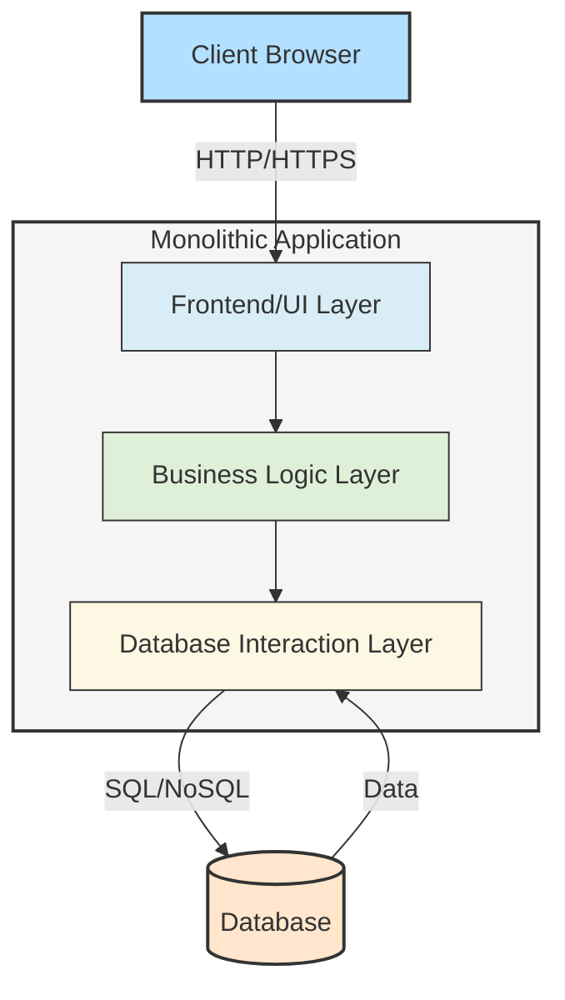
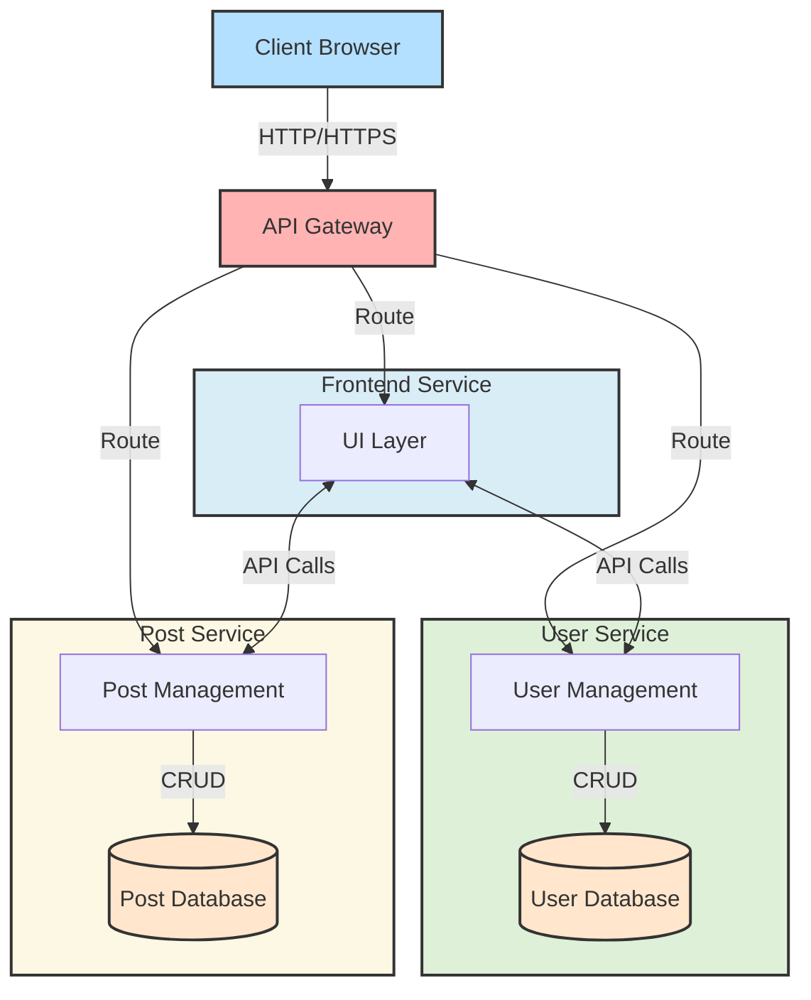

# Blog Microservices Architecture

### Description
This project is a microservices-based architecture for a blog platform. It was originally a monolithic application and has been refactored into microservices for better scalability and maintainability. It includes the following microservices:
- **User Service**: Handles user management (registration, login, etc.).
- **Post Service**: Manages blog posts (create, update, delete, view posts).
- **Frontend Service**: Provides the user interface for the blog platform.
- **API Gateway**: Routes client requests to the appropriate microservices.

The project is containerized using Docker and orchestrated with Kubernetes for deployment and scaling.

---

### Architecture Diagrams

#### Original Monolithic Architecture


#### New Microservices Architecture


### Monolith to Microservices Conversion Process

#### **Monolithic Architecture Overview**:
Originally, the entire application was structured as a single monolithic architecture where:
- All services (user management, post management, and frontend) were part of a single codebase.
- There was a single database handling all operations, with no separation of concerns.

The major drawbacks of the monolithic architecture were:
- **Scalability limitations**: Scaling the entire application required scaling all services together.
- **Maintenance difficulties**: Code changes in one part of the application could affect other parts.
- **Slow deployment cycles**: Changes had to be tested and deployed as a whole.

#### **Step-by-Step Conversion Process**:

1. **Identify Service Boundaries**:
   The first step was to identify the major components of the application that could be separated into independent services:
   - **User Management** (User Service)
   - **Blog Post Management** (Post Service)
   - **Frontend Presentation** (Frontend Service)

2. **Create Independent Microservices**:
   Each identified service was refactored into its own Flask-based microservice:
   - **User Service**: Handles all user-related actions (e.g., registration, login).
   - **Post Service**: Manages blog post creation, editing, and viewing.
   - **Frontend Service**: Serves the frontend UI and interacts with the other services.

3. **Decouple the Database**:
   In the monolithic architecture, there was a single database. In the microservices architecture:
   - Each service has its own dedicated database (or schema) to ensure separation of data and responsibilities.

4. **Introduce an API Gateway**:
   The API Gateway was added to act as a single entry point for all client requests. It forwards requests to the respective microservices:
   - `/users/` → **User Service**
   - `/posts/` → **Post Service**
   - `/frontend/` → **Frontend Service**

5. **Containerization**:
   Each service was containerized using Docker to ensure independent deployment, scalability, and resource isolation.

6. **Orchestration with Kubernetes**:
   Kubernetes was used to orchestrate the services, enabling easy scaling, deployment, and management of the microservices.

---

### Features
- Microservices architecture for scalability and maintainability.
- Dockerized services for easy container management.
- Kubernetes deployment for orchestration and scaling.
- API Gateway for routing and load balancing.
- Flask-based backend services.

### Technologies Used
- **Backend**: Flask (Python)
- **Containerization**: Docker
- **Orchestration**: Kubernetes (Minikube or cloud-based Kubernetes)
- **API Gateway**: NGINX
- **Databases**: SQLite (or other database systems)
- **Frontend**: Flask templates or static HTML

### Project Structure
```
blog-microservices-architecture/
│
├── user-service/             # User management microservice
│   ├── app.py               # Main application file
│   ├── models.py            # User database models
│   ├── requirements.txt     # Python dependencies
│   └── Dockerfile           # Docker configuration
│
├── post-service/            # Blog post management microservice
│   ├── app.py              # Main application file
│   ├── models.py           # Post database models
│   ├── requirements.txt    # Python dependencies
│   └── Dockerfile          # Docker configuration
│
├── frontend-service/        # Frontend microservice
│   ├── app.py              # Main application file
│   ├── static/             # Static files (HTML, CSS)
│   └── Dockerfile          # Docker configuration
│
├── api-gateway/            # API Gateway for routing
│   ├── nginx.conf          # NGINX configuration for routing
│   └── Dockerfile          # Docker configuration
│
├── kubernetes/             # Kubernetes deployment and service YAML files
│   ├── user-service-deployment.yaml
│   ├── post-service-deployment.yaml
│   ├── frontend-service-deployment.yaml
│   └── api-gateway-deployment.yaml
│
└── README.md               # Project documentation
```

---

### How to Run

#### Step 1: Clone the Repository
```bash
git clone https://github.com/subhashpolisetti/blog-microservices-architecture.git
cd blog-microservices-architecture
```

#### Step 2: Build Docker Images
```bash
# Build User Service
docker build -t user-service ./user-service

# Build Post Service
docker build -t post-service ./post-service

# Build Frontend Service
docker build -t frontend-service ./frontend-service

# Build API Gateway
docker build -t api-gateway ./api-gateway
```

#### Step 3: Deploy on Kubernetes
```bash
kubectl apply -f user-service/user-service-deployment.yaml
kubectl apply -f post-service/post-service-deployment.yaml
kubectl apply -f frontend-service/frontend-service-deployment.yaml
kubectl apply -f api-gateway/api-gateway-deployment.yaml
```

### Step 4: Access the Application
Access the services through the API Gateway:
- `/users/` for user operations
- `/posts/` for post operations
- `/frontend/` for the frontend interface

### Contact
Project Link: https://github.com/subhashpolisetti/blog-microservices-architecture
